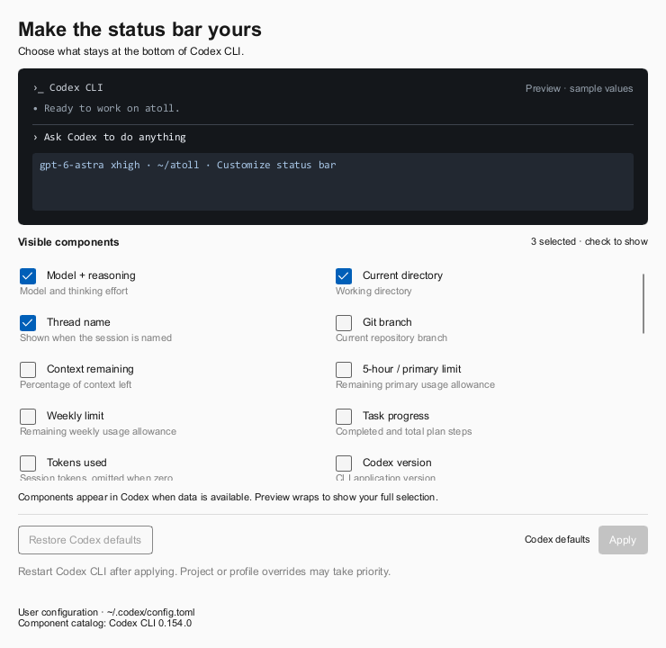

# Atoll

[中文](#中文) · [English](#english)

<p align="center">
  <a href="https://github.com/WXGopher/atoll/actions/workflows/ci.yml"></a>
  <a href="https://github.com/WXGopher/atoll/releases/latest"></a>
  
  <a href="LICENSE"></a>
</p>

## 中文

**在 Windows 任务栏查看 Codex 的剩余额度与会话状态，处理工具审批和提问，返回对应桌面对话或终端分屏。**

Atoll 以 Codex 为支持和验证对象，通过 hooks、本地会话日志及可选 app-server 接入跟踪活动。Claude Code 兼容代码保留为实验性，未在真实环境验证，新配置默认关闭其显示。平时只在任务栏显示简洁的额度与状态，需要时展开详情或审批卡片。

<p align="center">
  
</p>

### 功能

- **任务栏额度与状态**：显示每个代理最紧张的额度窗口，以及等待处理、运行中、已完成的会话数量。颜色阈值可在设置中调整；仅等待或运行状态需要动画。
- **按活动显示代理**：启动时恢复上次保存的代理显隐和会话文本；Codex 本地额度独立刷新，不改变代理显隐。收到 Claude hook 或新的 Codex 日志事件后更新，并隐藏连续十五分钟没有活动的代理；再次活动时自动显示。点击详情不会触发额度请求。
- **详情面板自动收起**：点击任务栏控件或托盘图标展开；点击桌面、其他窗口，或切换到其他窗口后自动收起。再次点击 Atoll 图标也能关闭。
- **悬停预览待办**：停留在任务栏控件上可预览等待处理的会话，不抢键盘焦点；移开后自动收起，点击可展开完整详情。
- **Codex 会话自动识别**：每两秒读取本地日志中的开始、完成和中断事件，支持从旧日志目录恢复的会话。启动时建立日志基线；检测到仍持有写入锁的运行会话时立即恢复跟踪。没有存活证据的会话在十五分钟无活动后移除。分页历史接入为实验性，补充识别无日志会话、失败、中断和归档；桌面原生提问仍需返回 Codex 作答。
- **Claude Code 审批卡片（实验性）**：允许或拒绝工具调用，回答 `AskUserQuestion`。已被你的权限设置允许的工具调用不会弹出审批卡片。
- **Codex 审批与终端信息**：可选安装 Codex hooks，在真实 `PermissionRequest` 上允许或拒绝工具调用，并记录终端来源用于跳转。普通 CLI 会话缺少 hooks 信息时，通过仍持有会话日志的进程寻找原终端；已识别的桌面会话使用官方链接打开对应 Codex 桌面对话。
- **后台完成通知**：观察到任务持续至少三十秒并完成后，发送静音 Windows 通知，弹出三秒后自动收起。不会补发历史完成、中断或短任务；正在查看详情或对应终端时也不提醒。设置中可关闭，Atoll 运行期间点击通知可返回会话或详情。
- **原生提问卡片**：通过 Atoll 启动的 Codex CLI 会话支持多题切换、完整选项说明、多行自由文本、密码遮罩和返回修改草稿。卡片与终端先答者生效，重复回复会被丢弃。
- **精确返回会话**：Atoll 启动时记录 Windows Terminal 标签页和分屏，即使藏在其他标签页后或正在滚动输出，也能返回原分屏；目标失效时回退原终端窗口。CLI 终端已关闭或无法定位时保留详情面板，不改为打开桌面 App。普通 CLI 的标签页和分屏定位仍依赖标题或可见文本。IDE 暂不纳入本轮支持。
- **设置与托盘**：支持开机启动、按代理显示或隐藏任务栏内容、修改颜色阈值。右键任务栏控件或托盘图标进入设置或退出。
- **Codex CLI 状态栏定制**：设置 → Codex TUI → Customize status bar，勾选组件实时预览，Apply 保存，Restore Codex defaults 恢复默认；支持全部隐藏。
- **任务栏集成**：跟随任务栏位置、自动隐藏和通知区域大小变化；嵌入失败时使用贴近任务栏的浮动显示。重复启动 Atoll 会替换旧实例。
- **额度读取**：Claude Code 使用其已有凭据读取额度，并尽量复用本机缓存；Codex 每 30 秒在后台读取本地 rollout 日志，按额度事件时间选择最新记录，避免旧会话覆盖新额度。请求受限时会退避重试。


当前源码版本为 v0.1.6。项目仍在早期开发，部分截图来自较早版本，具体外观以当前程序为准。Codex CLI 提问接入与桌面分页历史读取为实验性功能，桌面原生问题仍在 Codex 中作答。

### 安装与使用

从 [GitHub Releases](https://github.com/WXGopher/atoll/releases) 下载最新 Windows x86_64 压缩包，解压后在该目录运行：

```powershell
.\atoll.exe setup install codex
.\atoll.exe
```

第一条命令会将 `atoll.exe`、`atoll-hook.exe` 和 `atoll-codex.exe` 复制到 `%LOCALAPPDATA%\Atoll\bin` 并安装 Codex hooks。Codex 无需 hooks 即可读取本地会话和额度；安装后可检查 hooks：

```powershell
.\atoll.exe setup status codex
```

随后在 Codex 中运行 `/hooks` 审阅并信任新增配置，再开启新会话。Atoll 不会代替你完成信任审核。安装命令及审批协议已在 Codex CLI 0.154.0 的环境中验证；配置格式见 [Codex hooks 文档](https://learn.chatgpt.com/docs/hooks)。

在 Windows Terminal 中通过 Atoll 启动 Codex，即可启用提问卡片和精确分屏跳转：

```powershell
& "$env:LOCALAPPDATA\Atoll\bin\atoll-codex.exe"
# 在指定目录启动，或恢复已有对话
& "$env:LOCALAPPDATA\Atoll\bin\atoll-codex.exe" -C C:\github\atoll
& "$env:LOCALAPPDATA\Atoll\bin\atoll-codex.exe" --resume <会话ID>
```

此入口使用上游实验性的 [Codex app-server](https://learn.chatgpt.com/docs/app-server) / WebSocket 接口。中转仅在本机监听，要求临时令牌；退出后清理后端及其子进程。Atoll 未运行时仍可在 Codex 终端作答。现有桌面会话、普通 `codex` 命令启动的会话仍在 Codex 中回答；当前原生问题协议支持单选和文本，暂无多选。桌面直达使用[官方会话链接](https://learn.chatgpt.com/docs/app/commands)，需安装并注册 Codex 桌面应用。

- 左键点击任务栏控件或托盘图标：展开或收起详情。
- 悬停任务栏控件：有待处理会话时预览待办，移开后收起。
- 点击详情以外的位置，或切换窗口：自动收起详情。
- 右键点击任务栏控件或托盘图标：打开设置或退出。
- 需要开机启动时，在设置中打开相应开关。

检查或移除 hooks（按需选择代理）：

```powershell
.\atoll.exe setup status claude
.\atoll.exe setup uninstall claude
.\atoll.exe setup status codex
.\atoll.exe setup uninstall codex
```

`atoll.exe headless` 可在终端输出收到的 hook 事件，用于排查集成问题。它只监视 hook 事件流，不显示窗口。

### 定制 Codex CLI 状态栏



在设置的 **Codex TUI** 页打开编辑器。勾选表示显示，取消勾选表示隐藏；预览使用示例数据，不会发起模型请求。组件与默认预览按本机 Codex CLI **0.154.0** 的 `/statusline` 核对，包含模型、推理强度、目录、Git、上下文、额度、token 和会话信息。实际终端会省略无数据的组件，并按终端宽度显示。

点击 **Apply** 写入 `$CODEX_HOME/config.toml`（默认 `~/.codex/config.toml`）的 `tui.status_line`。全部取消后保存空列表以隐藏状态栏。现有组件顺序保持不变，新增组件排在后面；同一次编辑中取消再勾选会恢复原位置。重启 Codex CLI 后加载配置，可用 `codex resume` 继续已有会话。项目、profile 和命令行覆盖配置可能优先于此用户配置。

**Restore Codex defaults** 会立即移除用户配置中的 `tui.status_line`，由 Codex 自己决定默认展示，不会写入固定的默认列表。打开编辑器和勾选不写文件；保存及恢复前备份，保留其他配置和注释，状态栏在外部被修改时提示关闭并重新打开编辑器。恢复操作仅针对状态栏组件，主题和其他 TUI 设置保持原样。配置格式见 [OpenAI Docs 配置示例](https://learn.chatgpt.com/docs/config-file/config-sample)。

### 配置与本地数据

Atoll 在现有 hooks 旁添加自己的配置，卸载时只移除自己添加的部分。默认不修改 Claude Code 的 `statusLine`。旧的 `--wrap-status-line` 兼容选项仍保留，但通常无需使用。

| 路径或设置 | 用途 |
| --- | --- |
| `~/.claude/settings.json` | 安装、检查或移除 Atoll 的 hooks |
| `~/.claude/.credentials.json` | 只读，用于请求 Claude Code 额度；不记录凭据 |
| `~/.claude/projects/**/*.jsonl` | 只读，用于会话标题 |
| `~/.codex/sessions/**/*.jsonl` | 只读，用于 Codex 会话状态与额度 |
| `~/.codex/hooks.json`、`config.toml` | 可选安装 Codex hooks、启用 hooks 功能；修改前备份并保留其他配置 |
| `~/.codex/atoll-install.json` | 记录安装前的 hooks 开关，用于卸载恢复；用户后续修改的值会保留 |
| `%LOCALAPPDATA%\Atoll\bin` | hooks 使用的稳定安装路径，避免后续编译覆盖正在使用的程序 |
| `%APPDATA%\Atoll\display.json` | 上次显示的代理、额度和会话文本；不保存审批连接或终端跳转目标 |

环境变量：

| 变量 | 用途 |
| --- | --- |
| `CODEX_HOME` | 为 Codex 会话跟踪和 hooks 安装指定 `.codex` 目录的替代位置 |
| `ATOLL_PIPE_NAME` | 指定命名管道，适用于隔离开发实例 |
| `ATOLL_CONFIG_DIR` | 指定配置目录 |
| `ATOLL_SKIP_HOOKS=1` | 让 hook 程序直接退出，不连接 Atoll |

Atoll 未启动、忙碌或响应超时时，hooks 会让代理回到原终端继续询问。卸载 hooks 不会删除已安装的程序文件。

### 构建与验证

在 Windows 上安装近期稳定版 Rust 工具链后运行：

```powershell
cargo fmt --all --check
cargo clippy --workspace --all-targets -- -D warnings
cargo build --workspace
cargo test --workspace
cargo build --workspace --release
```

需要真实 Windows 桌面的窗口及显示恢复回归测试可单独运行：

```powershell
cargo test -p atoll native_slint_readout_stays_frameless -- --ignored --nocapture
cargo test -p atoll --test display_lifecycle -- --ignored --nocapture
```

已安装 Atoll 且系统允许通知时，可执行 `cargo test -p atoll native_completion_reaches -- --ignored --nocapture` 验证真实通知投递；测试会移除自己发送的通知。

正式发布包由 [GitHub Actions](.github/workflows/release.yml) 构建，包含 `atoll.exe`、`atoll-hook.exe`、`atoll-codex.exe`、README 和许可证。每个压缩包均提供 `SHA256SUMS.txt` 和构建来源证明，可使用 GitHub CLI 验证：

```powershell
gh attestation verify atoll-v0.1.6-windows-x86_64.zip --repo WXGopher/atoll
```

F01–F03 的交付范围与后续更新、远端会话候选项，见对照 open-vibe-island 整理的 [功能路线图](docs/ROADMAP.md)。更多代理、通知偏好和界面语言切换本轮不做。维护事项单列在 [已知问题](docs/KNOWN_ISSUES.md)。

### 致谢与许可证

Atoll 受到 macOS 项目 [open-vibe-island](https://github.com/Octane0411/open-vibe-island) 的启发，是独立的 Windows 原生实现，并非其代码移植。

采用 GPL-3.0-or-later 许可证，详见 [LICENSE](LICENSE)。

---

## English

**See Codex quota and sessions in the Windows taskbar, answer approvals and questions, and return to the exact desktop conversation or Terminal pane.**

Atoll focuses on Codex, using hooks, local session logs and an optional app-server connection. Claude Code compatibility is experimental, unverified on a real installation, and hidden by default in new configurations. Quota and task counts stay in the taskbar; details and approval cards appear when needed.

<p align="center">
  
</p>

### Features

- **Taskbar quota and status**: see each agent's tightest quota window and counts of waiting, running and completed sessions. Colour thresholds are configurable; only waiting or running states animate.
- **Activity-driven visibility**: startup restores saved agent visibility and session text; local Codex quota refreshes independently without changing visibility. A Claude hook or a new Codex log event updates the display and hides agents silent for fifteen minutes; activity brings them back. Opening details does not request quota.
- **Details that dismiss automatically**: click the readout or tray icon to open the panel. Click the desktop, another window, or switch windows to dismiss it. Clicking the Atoll icon again also closes it.
- **Hover preview**: dwell over the readout to see waiting sessions without taking keyboard focus. Move away to dismiss it or click to open full details.
- **Automatic Codex session tracking**: local start, completion and interruption events are read every two seconds, including conversations resumed from older directories. Startup establishes a log baseline and restores tracking immediately for running sessions with a live writer lock. Sessions without liveness evidence expire after fifteen minutes of inactivity. Experimental paginated-history support also detects sessions without rollout logs, failures, interruptions and archives. Desktop questions still require answering in Codex.
- **Claude Code approval cards (experimental)**: allow or deny tools and answer `AskUserQuestion`. Tools already allowed by your own permissions do not raise a card.
- **Codex approvals and terminal metadata**: optional hooks handle actual `PermissionRequest` events and record terminal ancestry for navigation. Plain CLI sessions without hook metadata locate their terminal through the process still holding the session log open. Identified desktop sessions open their exact conversation through the official Codex desktop link.
- **Background completion notifications**: silent Windows notifications follow tasks observed running for at least thirty seconds, and their popups dismiss after three seconds. Historical completions, interruptions, short tasks and sessions being watched in the panel or their terminal do not notify. Disable this in Settings; while Atoll is running, clicking a notification opens the session or details.
- **Exact session navigation**: sessions launched through Atoll remember their Windows Terminal tab and pane, including hidden tabs and changing output. Invalid targets fall back to their original terminal window. Missing or closed CLI terminals leave the panel open without launching the desktop app. Plain CLI tab and pane selection still relies on titles or visible text. IDE navigation is outside this release scope.
- **Native question cards**: navigate multiple questions, read option descriptions, write multiline answers, mask secret input, and return to edit drafts before submitting. The first answer from Atoll or the Codex terminal wins.
- **Settings and tray**: configure launch at login, agent visibility and colour thresholds. Right-click the readout or tray icon for Settings and Quit.
- **Codex CLI status bar**: open Settings → Codex TUI → Customize status bar, toggle components in a live preview, then Apply or Restore Codex defaults. All components can be hidden.
- **Taskbar integration**: follows the taskbar's position, auto-hide and notification-area size; falls back to a floating readout beside the taskbar if embedding fails. Starting another Atoll replaces the existing instance.
- **Quota readings**: Claude Code's existing credentials fetch quota with local cache reuse where possible; Codex quota is read in the background every 30 seconds, choosing the latest quota event across local rollout logs rather than relying on file modification times. Rate-limited requests back off before retrying.


The current source version is v0.1.6. The project is in early development and some screenshots show earlier versions. Codex CLI question integration and desktop paginated-history reads are experimental; desktop questions still require answering in Codex.

### Install and use

Download the latest Windows x86_64 archive from [GitHub Releases](https://github.com/WXGopher/atoll/releases), extract it, and run these commands from that directory:

```powershell
.\atoll.exe setup install codex
.\atoll.exe
```

The first command copies `atoll.exe`, `atoll-hook.exe` and `atoll-codex.exe` to `%LOCALAPPDATA%\Atoll\bin` and installs Codex hooks. Codex sessions and quota work without hooks. Check the hook configuration after installation:

```powershell
.\atoll.exe setup status codex
```

Then use `/hooks` in Codex to review and trust the new definitions, and start a new session. Atoll does not bypass this review. Installation commands and approval protocol were checked in an environment with Codex CLI 0.154.0; see the [Codex hooks documentation](https://learn.chatgpt.com/docs/hooks).

Launch a CLI session from Windows Terminal to enable question replies and exact pane navigation:

```powershell
& "$env:LOCALAPPDATA\Atoll\bin\atoll-codex.exe"
& "$env:LOCALAPPDATA\Atoll\bin\atoll-codex.exe" -C C:\github\atoll
& "$env:LOCALAPPDATA\Atoll\bin\atoll-codex.exe" --resume <thread-id>
```

This entry point uses the experimental [Codex app-server](https://learn.chatgpt.com/docs/app-server) and WebSocket interface, with an authenticated loopback-only relay. Closing the launcher cleans up its backend processes. Existing desktop sessions and ordinary CLI launches still answer inside Codex. Native questions currently support single choice or text, without a multi-select field. Desktop navigation requires the installed Codex URI handler and uses its [official local-thread link](https://learn.chatgpt.com/docs/app/commands).

- Left-click the taskbar readout or tray icon to toggle details.
- Hover over the readout to preview waiting sessions; move away to dismiss.
- Click outside the panel or switch windows to dismiss it.
- Right-click the readout or tray icon for Settings and Quit.
- Enable launch at login in Settings if desired.

Check or remove hooks for either agent:

```powershell
.\atoll.exe setup status claude
.\atoll.exe setup uninstall claude
.\atoll.exe setup status codex
.\atoll.exe setup uninstall codex
```

`atoll.exe headless` prints incoming hook events to the terminal for troubleshooting. It watches the hook stream without displaying windows.

### Customize the Codex CLI status bar

Open **Settings → Codex TUI → Customize status bar**. Checked components appear in the preview; unchecked components are hidden. The catalog and default preview were checked against `/statusline` in Codex CLI **0.154.0**. Values are illustrative; Codex omits unavailable data and fits the footer to its terminal width.

**Apply** saves `tui.status_line` in `$CODEX_HOME/config.toml` (normally `~/.codex/config.toml`). An empty selection hides the footer. Existing component order is preserved, new components follow it, and toggling off/on within a draft restores the original position. Restart Codex CLI to load the saved configuration; use `codex resume` to continue an existing session. Project, profile and command-line overrides may take precedence.

**Restore Codex defaults** immediately removes the user status-line override so Codex supplies its own defaults, including future changes. Opening and toggling do not write files. Saves and resets back up existing configuration, preserve unrelated settings and comments, and refuse to overwrite a footer changed outside the editor. Reset affects footer components only; themes and other TUI settings remain intact. See the [OpenAI Docs configuration sample](https://learn.chatgpt.com/docs/config-file/config-sample).

### Configuration and local data

Atoll adds its hooks alongside yours and removes only what it added. Claude Code's `statusLine` is unchanged by default. The legacy `--wrap-status-line` option remains available but is normally unnecessary.

| Path or setting | Purpose |
| --- | --- |
| `~/.claude/settings.json` | Install, inspect or remove Atoll hooks |
| `~/.claude/.credentials.json` | Read-only credentials for Claude Code quota requests; credentials are not logged |
| `~/.claude/projects/**/*.jsonl` | Read-only session titles |
| `~/.codex/sessions/**/*.jsonl` | Read-only Codex session activity and quota |
| `~/.codex/hooks.json`, `config.toml` | Optional Codex hook definitions and feature switch; backed up before edits, preserving unrelated settings |
| `~/.codex/atoll-install.json` | Previous hook feature state for uninstall; later user edits are preserved |
| `%LOCALAPPDATA%\Atoll\bin` | Stable hook binaries, kept separate from later builds |
| `%APPDATA%\Atoll\display.json` | Saved agent visibility, quota and session text; excludes approval connections and terminal targets |

Environment variables:

| Variable | Purpose |
| --- | --- |
| `CODEX_HOME` | Alternate `.codex` directory for Codex session and quota tracking and hook installation |
| `ATOLL_PIPE_NAME` | Named pipe override for an isolated development instance |
| `ATOLL_CONFIG_DIR` | Configuration directory override |
| `ATOLL_SKIP_HOOKS=1` | Exit the hook immediately without connecting to Atoll |

If Atoll is unavailable, busy or times out, hooks let the agent continue prompting in its terminal. Uninstalling hooks leaves the installed binaries in place.

### Build and verify

With a recent stable Rust toolchain on Windows:

```powershell
cargo fmt --all --check
cargo clippy --workspace --all-targets -- -D warnings
cargo build --workspace
cargo test --workspace
cargo build --workspace --release
```

Run the native window and display restoration regressions separately on a Windows desktop:

```powershell
cargo test -p atoll native_slint_readout_stays_frameless -- --ignored --nocapture
cargo test -p atoll --test display_lifecycle -- --ignored --nocapture
```

With Atoll installed and Windows notifications enabled, run `cargo test -p atoll native_completion_reaches -- --ignored --nocapture` to verify real delivery; the test removes its own notification afterwards.

Release archives are built by [GitHub Actions](.github/workflows/release.yml) and contain `atoll.exe`, `atoll-hook.exe`, `atoll-codex.exe`, the README and license. Each archive has a `SHA256SUMS.txt` checksum alongside it and a build provenance attestation. Verify the attestation with the GitHub CLI:

```powershell
gh attestation verify atoll-v0.1.6-windows-x86_64.zip --repo WXGopher/atoll
```

See the [feature roadmap](docs/ROADMAP.md) for gaps compared with open-vibe-island, including the delivered F01–F03 scope and candidate update/remote-session features; more agents, notification preferences and language switching are not planned. Maintenance work is tracked separately in [known issues](docs/KNOWN_ISSUES.md).

### Acknowledgements and license

Atoll is inspired by [open-vibe-island](https://github.com/Octane0411/open-vibe-island) for macOS. It is an independent Windows-native implementation, not a port of that project's code.

Licensed under GPL-3.0-or-later. See [LICENSE](LICENSE).
