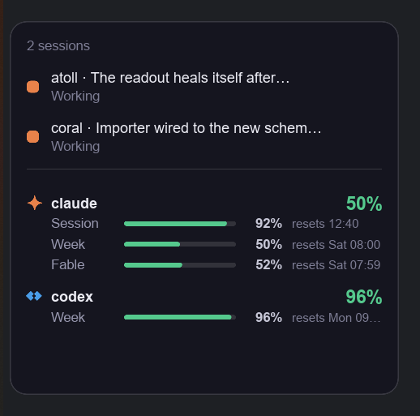

# Atoll — Toll Your Agents on Windows

**Claude Code's and Codex's remaining quota at a glance, live sessions one
click away, and approval cards you can answer without going back to the
terminal.** Windows-native, and invisible until you look.

<p align="center">
  
</p>

<p align="center">
  <a href="https://github.com/WXGopher/atoll/actions/workflows/ci.yml"></a>
  <a href="https://github.com/WXGopher/atoll/releases/latest"></a>
  
  <a href="LICENSE"></a>
</p>

Atoll watches your Claude Code and Codex sessions through their hook systems and
puts what matters where you already look: how much quota is left, in the
taskbar; what every session is doing, one click behind it; and a card in front
of you when a session needs an answer. Nothing sits on the desktop the rest of
the time.

## Status

Early development, but usable for Claude Code: the taskbar readout runs,
approvals and `AskUserQuestion` answers go back to a live session from the card,
and both agents' rate-limit windows are shown. Codex hook installation and
jumping back to a session's terminal are not done yet.

## What it looks like

**The taskbar readout** — a dot per agent and how much of its tightest
rate-limit window is left, *inside* the taskbar, in the empty stretch above the
notification area. While sessions are live it grows a task line: an amber
pulsing "?" for sessions waiting on you, a breathing dot for the ones running,
a quiet check for the ones done:


**The detail panel** — click the readout: every session Atoll is tracking, and
every rate-limit window both agents have reported, each with a bar you can read
at a glance rather than a sentence you have to parse. The same panel opens from
the tray icon.


**Approval cards** — a card opens beside the readout when Claude Code is about
to ask a human. Allow or deny a tool call, or pick an answer to a question,
without going back to the terminal:


## Features

- **Taskbar usage readout** — green above 50 %, amber above 20 %, red below. It
  is a fixed control, like the task-view button: it parks itself just clear of
  the notification area and moves along on its own as the tray grows; click it
  for the details. It is a child of the taskbar, so it follows the taskbar's
  z-order and auto-hide, and re-attaches on its own when the shell restarts. On
  a shell that will not take a child window it floats against the bar instead,
  with the same behaviour. Right-click it for Settings and Quit.
- **A task line that says what your sessions are doing** — pending, running and
  done, each with its own mark, per agent. The line appears only while sessions
  are live, and nothing animates unless something is pending or running, so an
  idle Atoll costs an idle machine nothing.
- **A settings window** — run at login, show or hide each agent's block in the
  readout, and move the two colour thresholds. A machine with only one of the
  agents installed just says so, and gives the other's rows back to the taskbar.
- **Approval cards** — tool calls your own settings already allow never raise a
  card, a card you have seen collapses on its own, and there is no window at
  all when nothing is being asked. Drag one somewhere better and it remembers.
- **One Atoll at a time** — starting Atoll replaces whatever Atoll is already
  running rather than refusing to start, so a shortcut double-clicked twice, or
  a freshly built binary, never leaves two of them fighting over the pipe.
- **Tray icon and panel** — a drawn icon carrying the session count, and the
  same detail panel from the notification area.
- **Rate-limit usage, frugally** — Claude Code's windows from the same OAuth
  endpoint its own tooling reads, and Codex's from its rollout files. The
  endpoint rate-limits the shared token, so Atoll reuses any reading another
  tool on the machine already fetched and mostly sends no requests of its own.
  Nothing to configure and nothing of yours to displace.

## Install

Download the latest zip from
[Releases](https://github.com/WXGopher/atoll/releases), unzip it anywhere, and
from that directory:

```sh
atoll setup install claude   # copy the binaries somewhere stable and wire the hooks
atoll                        # the taskbar readout and the tray icon
```

Or build from source, with a recent stable Rust toolchain:

```sh
cargo build --workspace --release
```

Release binaries are built and published by the
[release workflow](.github/workflows/release.yml) on GitHub's own runners —
no hand-built artifact is ever uploaded. Each zip ships with its SHA-256 in
`SHA256SUMS.txt` and a signed [build provenance attestation](https://docs.github.com/en/actions/security-for-github-actions/using-artifact-attestations)
tying it to the exact commit and workflow run that produced it:

```sh
gh attestation verify atoll-v0.1.0-windows-x86_64.zip --repo WXGopher/atoll
```

To run Atoll at login, flip the switch in Settings — right-click the readout,
or the tray icon. It keeps the registry Run key for you, and migrates any
Startup-folder shortcut left over from older instructions.

## Using it

`atoll setup status claude` says what is currently wired up, and
`atoll setup uninstall claude` removes Atoll's hooks while leaving any of your
own alone. `atoll headless` runs the same pipe server with no windows at all and
prints the event stream, which is the first place to look when something is not
arriving.

Planned: Codex hook installation, jumping back to Windows Terminal or VS Code,
and toast notifications — the working list lives in
[docs/ROADMAP.md](docs/ROADMAP.md).

### Your configuration is only ever added to

Atoll appends its hooks alongside yours and takes back exactly what it added.
**`statusLine` is not touched at all** — not read, not written, not considered.
Atoll gets Claude Code's usage from `/api/oauth/usage`, using the token Claude
Code already stores, so it has no reason to occupy a setting you look at all day.

`--wrap-status-line` still exists for anyone who wants the old behaviour, and one
warning comes with it: Claude Code stops running a status line command that
fails repeatedly, for the rest of the session.

### Where the binaries live

`atoll setup install` copies the running `atoll.exe` and its `atoll-hook.exe`
into `%LOCALAPPDATA%\Atoll\bin` and points your hooks at those. Whatever
`settings.json` names runs on every hook and every turn, so it must not be a path
that gets rewritten underneath a live session — pointing it at a build directory
means the next `cargo build` breaks hooks mid-session. Uninstalling leaves the
copies in place.

### What Atoll reads

- `~/.claude/settings.json` — hooks, added to and removed from.
- `~/.claude/.credentials.json` — **read-only**, for the OAuth token that fetches
  your usage. It is held in memory for one HTTPS request and never logged,
  written, or sent anywhere else.
- `~/.claude/projects/**.jsonl` and `~/.codex/sessions/**.jsonl` — read-only, for
  session titles and Codex's rate limits.

Three environment variables matter. `ATOLL_PIPE_NAME` moves the named pipe and
`ATOLL_CONFIG_DIR` moves the settings file — together they let a second Atoll run
beside the one you use without the two fighting over a window position.
`ATOLL_SKIP_HOOKS=1` makes the hook binary exit immediately without connecting.

Whatever goes wrong, the hook fails open: if Atoll is not running, is busy, or
takes too long, the agent falls back to prompting in its own terminal.

## Acknowledgements

Atoll is inspired by [open-vibe-island](https://github.com/Octane0411/open-vibe-island),
a macOS tool by Octane0411, which is likewise licensed under the GPL-3.0. Atoll
is an independent Windows-native implementation of the same idea, not a port of
its code.

## License

GPL-3.0-or-later. See [LICENSE](LICENSE).
